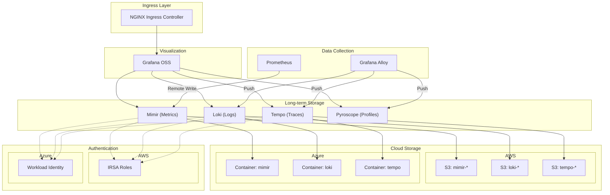

# Grafana OSS Observability Stack

A production-ready Terraform module for deploying a complete observability stack on Kubernetes, supporting both **AWS (EKS)** and **Azure (AKS)** cloud providers.

## Overview

This module deploys and configures:

| Component      | Purpose                    | Storage               |
| -------------- | -------------------------- | --------------------- |
| **Grafana**    | Visualization & Dashboards | -                     |
| **Prometheus** | Metrics collection         | Remote write to Mimir |
| **Mimir**      | Long-term metrics storage  | S3 / Azure Blob       |
| **Loki**       | Log aggregation            | S3 / Azure Blob       |
| **Tempo**      | Distributed tracing        | S3 / Azure Blob       |
| **Pyroscope**  | Continuous profiling       | Local                 |

## Architecture



## Features

- **Multi-Cloud Support**: Deploy on AWS EKS or Azure AKS with a single module
- **Component Toggles**: Enable/disable individual components as needed
- **Cloud-Native Auth**: IRSA (AWS) or Workload Identity (Azure) - no static credentials
- **Alerting Integration**: Built-in support for Slack and Microsoft Teams
- **SSO Ready**: Configure OIDC/OAuth2 authentication for Grafana
- **Production Defaults**: Sensible resource requests/limits and storage configurations
- **Automatic Datasources**: Grafana pre-configured with all component datasources
- **Folder Organization**: Structured Grafana folders for dashboards and alerts

## Quick Start

### AWS (EKS)

```hcl
module "observability" {
  source = "github.com/WeAura/weaura-terraform-modules//modules/grafana-oss?ref=v1.0.0"

  # Cloud Configuration
  cloud_provider = "aws"
  aws_region     = "us-east-1"
  environment    = "production"
  project_name   = "myproject"

  # EKS Configuration
  eks_cluster_name       = "my-eks-cluster"
  eks_oidc_provider_arn  = "arn:aws:iam::123456789012:oidc-provider/oidc.eks.us-east-1.amazonaws.com/id/EXAMPLED539D4633E53DE1B71EXAMPLE"
  eks_oidc_provider_url  = "oidc.eks.us-east-1.amazonaws.com/id/EXAMPLED539D4633E53DE1B71EXAMPLE"

  # Components (all enabled by default)
  enable_grafana    = true
  enable_prometheus = true
  enable_mimir      = true
  enable_loki       = true
  enable_tempo      = true
  enable_pyroscope  = true

  # Ingress
  grafana_ingress_enabled = true
  grafana_ingress_host    = "grafana.example.com"

  # Alerting
  alerting_provider            = "slack"
  slack_webhook_secret_name    = "observability/slack-webhook"

  tags = {
    Team        = "platform"
    CostCenter  = "infrastructure"
  }
}
```

### Azure (AKS)

```hcl
module "observability" {
  source = "github.com/WeAura/weaura-terraform-modules//modules/grafana-oss?ref=v1.0.0"

  # Cloud Configuration
  cloud_provider = "azure"
  environment    = "production"
  project_name   = "myproject"

  # Azure Configuration
  azure_subscription_id = "00000000-0000-0000-0000-000000000000"
  azure_resource_group  = "rg-observability"
  azure_location        = "eastus"

  # AKS Configuration
  aks_cluster_name     = "my-aks-cluster"
  aks_oidc_issuer_url  = "https://eastus.oic.prod-aks.azure.com/00000000-0000-0000-0000-000000000000/00000000-0000-0000-0000-000000000000/"

  # Components
  enable_grafana    = true
  enable_prometheus = true
  enable_mimir      = true
  enable_loki       = true
  enable_tempo      = true
  enable_pyroscope  = true

  # Ingress
  grafana_ingress_enabled = true
  grafana_ingress_host    = "grafana.example.com"

  # Alerting
  alerting_provider           = "teams"
  teams_webhook_secret_name   = "observability-teams-webhook"
  azure_key_vault_name        = "kv-observability"

  tags = {
    Team        = "platform"
    CostCenter  = "infrastructure"
  }
}
```

### Minimal (Grafana + Prometheus only)

```hcl
module "observability" {
  source = "github.com/WeAura/weaura-terraform-modules//modules/grafana-oss?ref=v1.0.0"

  cloud_provider = "aws"
  aws_region     = "us-east-1"
  environment    = "dev"
  project_name   = "myproject"

  eks_cluster_name       = "my-eks-cluster"
  eks_oidc_provider_arn  = "arn:aws:iam::123456789012:oidc-provider/..."
  eks_oidc_provider_url  = "oidc.eks.us-east-1.amazonaws.com/id/..."

  # Only Grafana and Prometheus
  enable_grafana    = true
  enable_prometheus = true
  enable_mimir      = false
  enable_loki       = false
  enable_tempo      = false
  enable_pyroscope  = false
}
```

## Component Configuration

### Grafana

Grafana is deployed with:

- Pre-configured datasources for all enabled components
- Default folder structure for organizing dashboards
- Optional SSO/OIDC integration
- Ingress configuration via NGINX

```hcl
# SSO Configuration
grafana_auth_generic_oauth_enabled       = true
grafana_auth_generic_oauth_name          = "Keycloak"
grafana_auth_generic_oauth_client_id     = "grafana"
grafana_auth_generic_oauth_auth_url      = "https://keycloak.example.com/realms/main/protocol/openid-connect/auth"
grafana_auth_generic_oauth_token_url     = "https://keycloak.example.com/realms/main/protocol/openid-connect/token"
grafana_auth_generic_oauth_api_url       = "https://keycloak.example.com/realms/main/protocol/openid-connect/userinfo"
grafana_oauth_client_secret_name         = "observability/grafana-oauth"
```

### Resource Configuration

Each component supports custom resource allocation:

```hcl
# Example: Custom Mimir resources
mimir_resources = {
  distributor = {
    requests = { cpu = "500m", memory = "512Mi" }
    limits   = { cpu = "2", memory = "2Gi" }
  }
  ingester = {
    requests = { cpu = "1", memory = "2Gi" }
    limits   = { cpu = "4", memory = "8Gi" }
  }
  querier = {
    requests = { cpu = "500m", memory = "512Mi" }
    limits   = { cpu = "2", memory = "2Gi" }
  }
  # ... other components
}
```

### Storage Configuration

#### AWS S3

S3 buckets are created automatically with:

- Server-side encryption (AES256)
- Versioning enabled
- Lifecycle rules for cost optimization
- IRSA-based access (no static credentials)

```hcl
# Customize S3 lifecycle
s3_lifecycle_rules = {
  mimir = {
    expiration_days                  = 365
    noncurrent_version_expiration_days = 30
  }
  loki = {
    expiration_days                  = 90
    noncurrent_version_expiration_days = 7
  }
  tempo = {
    expiration_days                  = 30
    noncurrent_version_expiration_days = 7
  }
}
```

#### Azure Blob Storage

Azure containers are created automatically with:

- Storage account with hierarchical namespace
- Managed Identity access via Workload Identity
- Role assignments for each component

### Alerting

Configure alerting destinations:

#### Slack

```hcl
alerting_provider         = "slack"
slack_webhook_secret_name = "observability/slack-webhook"  # AWS Secrets Manager path
```

#### Microsoft Teams

```hcl
alerting_provider         = "teams"
teams_webhook_secret_name = "observability-teams-webhook"  # Azure Key Vault secret name
azure_key_vault_name      = "kv-observability"
```

### Custom Grafana Folders

```hcl
grafana_custom_folders = [
  {
    uid   = "team-alpha"
    title = "Team Alpha Dashboards"
  },
  {
    uid   = "team-beta"
    title = "Team Beta Dashboards"
  }
]
```

## Cloud Provider Comparison

| Feature        | AWS                  | Azure                   |
| -------------- | -------------------- | ----------------------- |
| Kubernetes     | EKS                  | AKS                     |
| Identity       | IRSA                 | Workload Identity       |
| Object Storage | S3                   | Azure Blob Storage      |
| Secrets        | AWS Secrets Manager  | Azure Key Vault         |
| IAM            | IAM Roles + Policies | Managed Identity + RBAC |

## Examples

- [AWS Complete](./examples/aws-complete/) - Full AWS deployment with all components
- [Azure Complete](./examples/azure-complete/) - Full Azure deployment with all components
- [Minimal](./examples/minimal/) - Grafana + Prometheus only

## Vendorization Variables

These variables are specific to WeAura's white-label distribution and enable tenant isolation, branding customization, and retention policy configuration for multi-tenant deployments.

| Variable | Type | Required | Default | Description |
|----------|------|----------|---------|-------------|
| `tenant_id` | string | ✅ Yes | - | Unique tenant identifier (lowercase alphanumeric + hyphens only). Used for S3 bucket paths, namespace naming, IAM role naming. |
| `tenant_name` | string | ✅ Yes | - | Human-readable tenant name (e.g., 'ACME Corporation'). Used for resource tagging and documentation. |
| `branding_app_title` | string | ❌ No | `"Grafana"` | Grafana browser tab title and header title (grafana.ini: server.app_title). |
| `branding_app_name` | string | ❌ No | `"Grafana"` | Grafana application name shown in UI (grafana.ini: server.app_name). |
| `branding_login_title` | string | ❌ No | `"Welcome"` | Login page title text. |
| `branding_logo_url` | string | ❌ No | `""` | URL to custom logo image (SVG/PNG/JPG). Empty string disables logo replacement. |
| `branding_css_overrides` | string | ❌ No | `""` | Custom CSS overrides for additional branding. Empty string disables CSS customization. |
| `retention_loki_hours` | number | ❌ No | `720` | Loki logs retention period in hours (default: 720 = 30 days). |
| `retention_mimir_hours` | number | ❌ No | `2160` | Mimir metrics retention period in hours (default: 2160 = 90 days). |
| `retention_tempo_hours` | number | ❌ No | `168` | Tempo traces retention period in hours (default: 168 = 7 days). |
| `retention_pyroscope_hours` | number | ❌ No | `720` | Pyroscope profiles retention period in hours (default: 720 = 30 days). |
| `secrets_provider` | string | ❌ No | `"kubernetes"` | Secrets management provider: 'kubernetes' (plain Secrets) or 'external-secrets' (External Secrets Operator). |
| `database_type` | string | ❌ No | `"sqlite"` | Grafana database type: 'sqlite' (default, single-pod only) or 'postgres' (required for HA). |

## Requirements

| Name       | Version  |
| ---------- | -------- |
| terraform  | >= 1.5.0 |
| aws        | >= 5.0   |
| azurerm    | >= 3.0   |
| azuread    | >= 2.0   |
| kubernetes | >= 2.20  |
| helm       | >= 2.10  |
| kubectl    | >= 2.0   |
| grafana    | >= 2.0   |

## Providers

This module uses the following providers:

- `aws` - AWS resources (S3, IAM, Secrets Manager)
- `azurerm` - Azure resources (Storage, Managed Identity)
- `azuread` - Azure AD (Federated Credentials)
- `kubernetes` - Kubernetes resources (Namespaces, ServiceAccounts)
- `helm` - Helm chart deployments
- `kubectl` - Raw Kubernetes manifests
- `grafana` - Grafana resources (Folders, Alerting)

<!-- BEGIN_TF_DOCS -->

## Inputs

| Name           | Description                                       | Type     | Default | Required |
| -------------- | ------------------------------------------------- | -------- | ------- | :------: |
| cloud_provider | Cloud provider: 'aws' or 'azure'                  | `string` | n/a     |   yes    |
| environment    | Environment name (e.g., dev, staging, production) | `string` | n/a     |   yes    |
| project_name   | Project name used for resource naming             | `string` | n/a     |   yes    |

## Outputs

| Name           | Description             |
| -------------- | ----------------------- |
| grafana_url    | Grafana URL             |
| prometheus_url | Prometheus internal URL |
| mimir_url      | Mimir internal URL      |
| loki_url       | Loki internal URL       |
| tempo_url      | Tempo internal URL      |
| pyroscope_url  | Pyroscope internal URL  |

<!-- END_TF_DOCS -->

## Contributing

See [CONTRIBUTING.md](../../CONTRIBUTING.md) for contribution guidelines.

## License

Apache 2.0 - See [LICENSE](../../LICENSE) for details.
